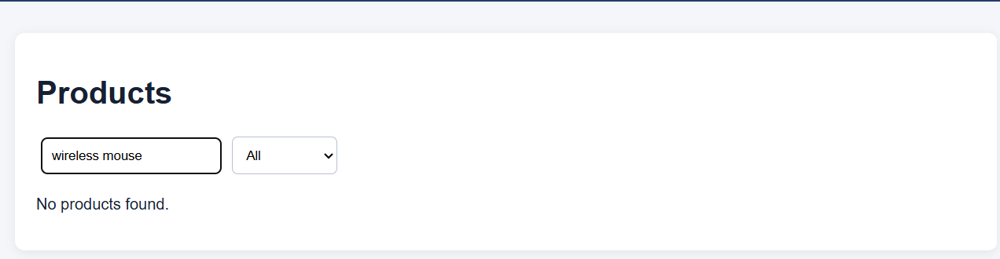
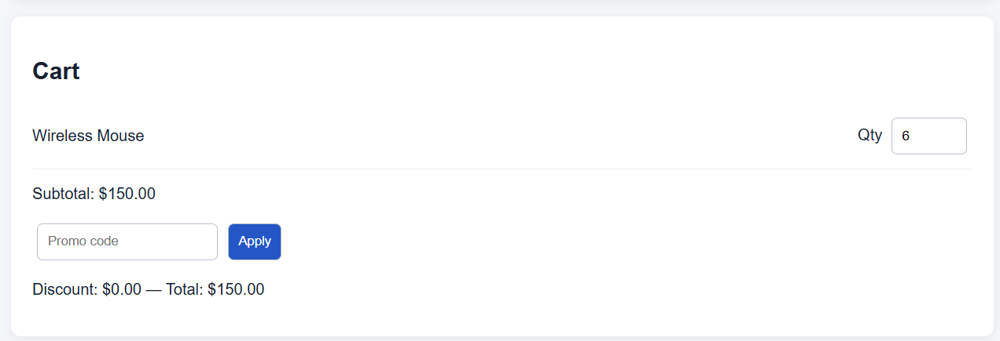
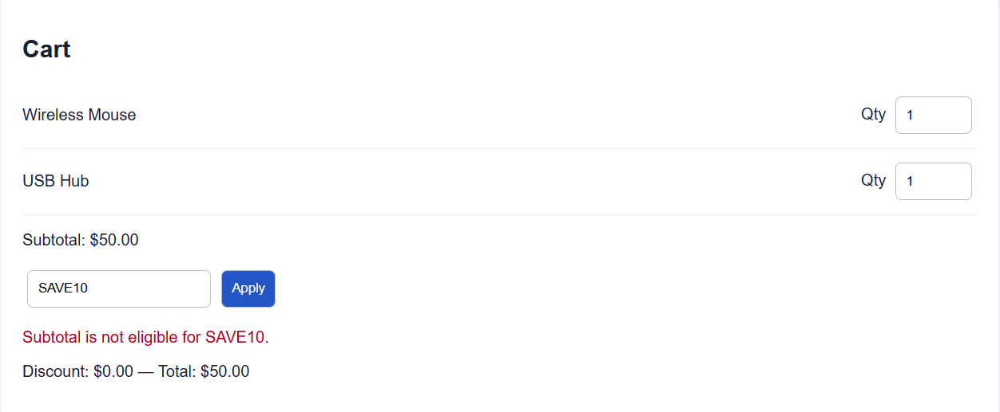
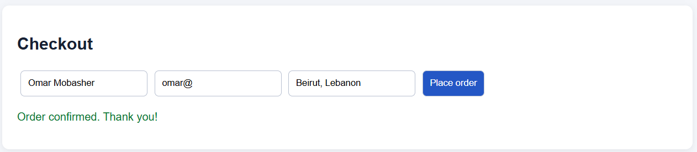

# Defect Reports

## DEF-001 — Product search is case-sensitive

- **Severity:** Medium
- **Priority:** Medium
- **Status:** Open
- **Requirement:** REQ-03
- **Environment:** Local ShopEasy app; Chrome/Edge on Windows 11

### Preconditions

The user is logged in and the product catalog is visible.

### Steps to reproduce

1. Enter `wireless mouse` in the search field.
2. Observe the displayed products.

### Expected result

`Wireless Mouse` is displayed because search must ignore letter case.

### Actual result

No product is displayed.

### Evidence

---

## DEF-002 — Cart accepts quantities above the maximum of five

- **Severity:** High
- **Priority:** High
- **Status:** Open
- **Requirement:** REQ-06
- **Environment:** Local ShopEasy app; Chrome/Edge on Windows 11

### Preconditions

The user is logged in and Wireless Mouse has been added to the cart.

### Steps to reproduce

1. Open the cart.
2. Change the Wireless Mouse quantity to `6`.
3. Move focus away from the quantity field.

### Expected result

The quantity is rejected or reset to the maximum value of 5.

### Actual result

Quantity 6 is accepted and used in the subtotal.

### Evidence

---

## DEF-003 — SAVE10 is rejected at the exact $50 eligibility boundary

- **Severity:** High
- **Priority:** High
- **Status:** Open
- **Requirement:** REQ-08
- **Environment:** Local ShopEasy app; Chrome/Edge on Windows 11

### Preconditions

The user is logged in and the cart subtotal is exactly $50.00.

### Steps to reproduce

1. Enter `SAVE10` in the promotional-code field.
2. Select **Apply**.

### Expected result

A $5.00 discount is applied because the eligible subtotal is at least $50.

### Actual result

The application reports that the order is ineligible and applies no discount.

### Evidence

---

## DEF-004 — Checkout accepts a malformed email address

- **Severity:** High
- **Priority:** High
- **Status:** Open
- **Requirement:** REQ-09
- **Environment:** Local ShopEasy app; Chrome/Edge on Windows 11

### Preconditions

The cart contains at least one product and checkout is open.

### Steps to reproduce

1. Enter `Alex Tester` as the name.
2. Enter `alex@` as the email address.
3. Enter `1 Main St` as the address.
4. Select **Place order**.

### Expected result

Submission is blocked and an email-format validation message is displayed.

### Actual result

The application accepts the order and displays confirmation.

### Evidence

